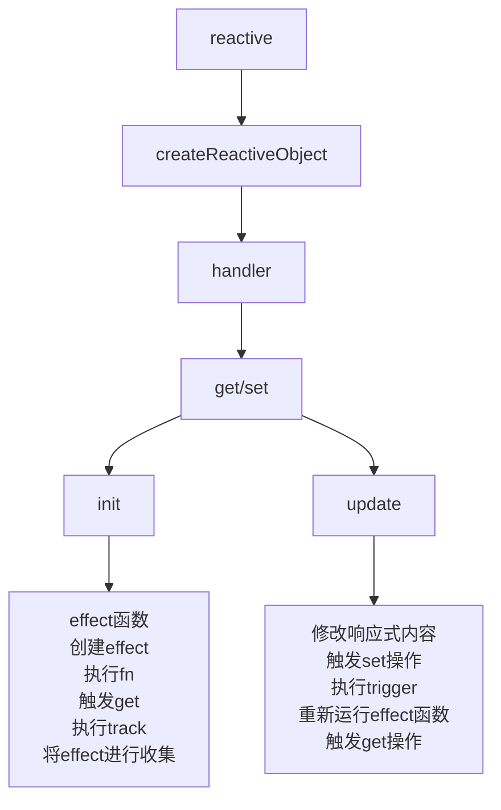

# reactive核心流程

#### 复习 proxy

proxy对象能够设置set和get自定义属性的读取和复制行为

```ts
const target = {}
const handler = {
	get(target,property,receive){
		// 拦截属性读取
	}
	set(target,property,value,receive){
		// 拦截属性赋值
	}
}
const proxy = new Proxy(target,handler)
```

get ： target目标对象，property 被读取的属性名 ，receiver proxy实例或继承对象

set ：target目标对象，property 被设置的属性名，value设置的新值，recriver Proxy实例或继承对象

Reflect ：提供了js操作的方法，和proxy拦截器方法对应，更优雅的操作对象，

```ts
Reflect.get(target,prop) === target[prop]
// ...
```

避免手动的操作源对象

和proxy的对应的关系

| **Proxy 拦截器** |     **Reflect 方法**     |
| :--------------: | :----------------------: |
|      `get`       |      `Reflect.get`       |
|      `set`       |      `Reflect.set`       |
|      `has`       |      `Reflect.has`       |
| `deleteProperty` | `Reflect.deleteProperty` |
|   `construct`    |   `Reflect.construct`    |

receive参数能够正确的绑定this

track | trigger ： 依赖收集和触发更新

当访问一个响应式的数据的时候，track会记录当前正在运行的副作用函数，建立依赖关系 
在getter中调用

当响应式的数据修改时，trigger会找到所有依赖的副作用函数，并重新执行一次，数据变化 -> 自动更新
在setter中调用

响应式对象的基本实现

```ts
const reactive = (obj) => {
  return new Proxy(obj, {
    get(target, key) {
      track(target, key) // 读取时收集依赖
      return Reflect.get(target, key)
    },
    set(target, key, value) {
      Reflect.set(target, key, value)
      trigger(target, key) // 修改时触发更新
      return true
    }
  })
}
```

effect : 封装副作用函数，并在数据发生变化的时候自动重新执行，依赖的追踪，自动执行触发依赖，副作用管理

接收用户给的function操作 


## 创建proxy

将一个对象传递进来，根据对象创建一个proxy代理对象

### get的创建

获得对象的属性值，并进行返回

### set的创建

创建一个set 传递新值，并进行设置，将新值传递出去

### effect

依赖的收集

### init

1. 创建effect 
2. 执行fn 传进来的函数
3. 触发get操作
4. 执行track
5. 将effect进行收集

dep收集依赖

### update

1. 修改对应的响应式的值
2. 触发set操作
3. 执行trigger
4. 重新运行effect函数
5. 执行fn
6. 触发get操作
7. 对应的函数执行



